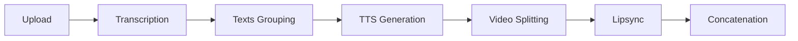

<div id="top"></div>

<!-- PROJECT LOGO and HEADER -->
<div style="overflow: hidden;">
  <h1 align="center"> 🎤 Vocalsync </h1>
  <p align="center">
  ⚡ Clone any voice from seconds of audio and transplant it onto any video ⚡
  </p>
</div>

---

## 🎬 Demo
<table class="center">
  <tr style="font-weight: bolder;text-align:center;">
        <td width="50%"><b>Original video</b></td>
        <td width="50%"><b>Lip-synced video</b></td>
  </tr>
  <tr>
    <td>
      <video src=https://github.com/user-attachments/assets/70e16d68-93c8-4b96-80cd-0673d36cef3d controls preload></video>
    </td>
    <td>
      <video src=https://github.com/user-attachments/assets/03031de1-b941-49db-8262-fc96ac9abc4c controls preload></video>
    </td>
  </tr>
</table>

## 🎯 Overview

Automated pipeline for video dubbing with TTS voice cloning and lipsync. Provide a source video and a voice sample - the system transcribes the video, generates new audio with the cloned voice, and syncs the lips to match.

### Architecture

```
┌─────────────┐     ┌──────────────┐     ┌─────────────┐
│     TTS     │────▶│ Orchestrator │◀────│  Lipsync    │
│  (Whisper + │     │  (REST API)  │     │ (LatentSync)│
│ Chatterbox) │     └──────────────┘     └─────────────┘
└─────────────┘                                          
```

**TTS Component**
- Transcribes video using [Whisper](https://github.com/openai/whisper)
- Generates speech with [Chatterbox](https://github.com/resemble-ai/chatterbox) (current SOTA as of Nov 2025)

**Lipsync Component**
- Syncs lips to generated audio using [LatentSync](https://github.com/bytedance/LatentSync) (current SOTA as of Nov 2025)

**Orchestrator**
- Coordinates the pipeline and exposes REST API

---

## 🔧 Prerequisites

- Docker & Docker Compose
- NVIDIA GPU with CUDA support
- `nvidia-docker` runtime installed
- **At least 12GB VRAM** (recommended)

---

## 🚀 Installation

1. **Clone the repository**
   ```bash
   git clone https://github.com/jojiku/Vocalsync.git
   cd Vocalsync
   ```
For Docker usage:

2. **Build and start all services**
   ```bash
   sudo docker compose up --build
   ```

   > ⏱️ **First startup takes 5-10 minutes** as models download:
   > - Whisper medium (~1.5GB)
   > - ChatterboxMultilingualTTS (~2GB)

---
For notebooks usage:

In case of limited hardware, you may want to use Kaggle's free GPU. Simpy run notebooks in kaggle with T4 enabled in this order: 
1. Chatterbox.ipynb
2. First half of orchestrator.ipynb
3. Latentsync.ipynb
4. Second half of orchestrator.ipynb.
Chatterbox and latentsync have conflicting dependencies, so its impossible to run everything in one environment.

## 💻 Usage

Send a POST request with your video and voice sample:

```bash
curl -X POST http://localhost:8000/process \
  -F "video=@/path/to/your/video.mp4" \
  -F "voice_sample=@/path/to/voice_sample.wav"
```

### Parameters

| Parameter | Description | Format |
|-----------|-------------|--------|
| `video` | Source video file | MP4 |
| `voice_sample` | Clean audio sample for voice cloning | WAV (5-15 seconds recommended) |

---

## 🔄 Processing Pipeline



1. **Upload** - Client sends video + voice sample
2. **Transcription** - Whisper transcribes original audio
3. **Text Grouping** - Segments grouped into optimal TTS chunks (200-310 chars)
4. **TTS Generation** - ChatterboxMultilingualTTS generates audio with cloned voice
5. **Video Splitting** - Source video split into segments matching audio duration (each segment is no more than minute because of RAM limitations)
6. **Lipsync** - LatentSync processes each segment
7. **Concatenation** - Final video assembled from processed segments

---

## ⚡ Performance

**T4 GPU Benchmarks:**

| Video Length | Processing Time |
|-------------|----------------|
| Small (1-2 min) | ~15 minutes |
| Medium (5-10 min) | ~30-70 minutes |
| Large (30+ min) | ~7 hours |

> ⚠️ Processing time varies based on video length, GPU performance, and TTS chunk count.

---
### Limitations
1. Only useful in case of short voice sample presented. In case of abundance of voice you're better off with RVC
2. In order to use the project for deepfakes or any other reason, change the code in orchestrator so it wont transcribe the initial video
3. Latentsync depends on audio duration, so excess video frames are cut off. Again, better to use RVC if you need to keep the whole video

---
### Parameters

## 🙏 Credits

- [**Whisper**](https://github.com/openai/whisper) by OpenAI
- [**ChatterboxMultilingualTTS**](https://github.com/resemble-ai/chatterbox)
- [**LatentSync**](https://github.com/bytedance/LatentSync) by ByteDance

---

## 📝 License

This project is licensed under the MIT License - see the [LICENSE](LICENSE) file for details.

---
